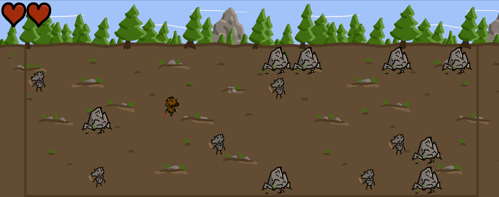
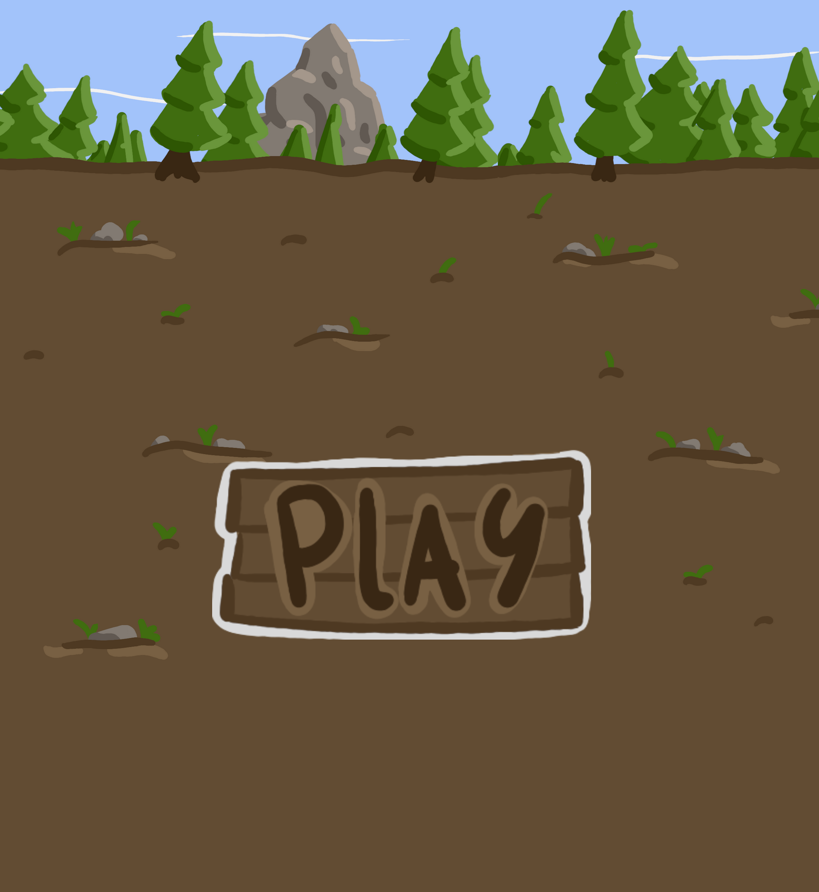

# 🐗 **Hog Rush** 

> Help Snout navigate through the forest in this side-scroller shoot-em-up and collect a Truffle for his soup!

---

## 🌐 **Play the Game**
[Click here to play the game!](https://ulfderdritte.github.io/CCL1)

---

## 📸 **Screenshots**

### Main Gameplay:

  
  
*Figure 1: Snout braving the wilds and taking on wolves.*

---

### Menu:

  
  
*Figure 2: The Main Menu.*

---

## 🎨 **Spritesheets**
Below are the sprites used to create characters and objects in the game:

### Snout, the Player Character:

  
  
*Figure 3: The spritesheet for the player character Snout.*

---

### Wolves:

  
  
*Figure 4: The spritesheet for the enemy wolves.*

### Rocks:

  
  
*Figure 5: The sprite for the static rocks.*

---

## ✍️ **Reflection**

### What went well:
- **Creative Design:** The theme wasn't too hard to get done once I got going.
- **Core Mechanics:** The movement and shooting came together without much issue. Figuring out and implementing cooldowns for shooting and taking damage was fun. 

### Challenges:
- **Code:** I couldn't get everything I had plannet into the game cause I ran out of time, which is the reason for the static background and the lack of more levels since I ran out of time to make more enemies.
- **Sprites:** I underestimated the time it would take to finish making the artwork for the game, scrambling to get it all done in time.

### Lessons Learned:
- **Time Managment:** I need to improve my time managment and make more concrete plans from the start to have a rough timeframe for things to add.
- **Art:** Creating better placeholder sprites, such as static versions of the finished ones could have been helpful in finding inspiration for mechanics.
